# BidWave

**A real-time live auction marketplace built with Flutter & Firebase.**

BidWave lets anyone be both a seller and a bidder. Post an item, set a timer, and watch bids update live across every device. Its standout feature is **anti-snipe protection**: if a bid lands in the final 10 seconds, the timer automatically extends by 30 seconds — keeping every auction fair to the last moment.

Built with **Clean Architecture**, **BLoC**, **SOLID principles**, and **dependency injection (get_it)**, with all notifications and auction lifecycle handled reliably by **Firebase Cloud Functions**.

> **Platform:** Android &nbsp;•&nbsp; **State Management:** flutter_bloc &nbsp;•&nbsp; **Backend:** Firebase

---

## Table of Contents

1. [Features](#-features)
2. [Dependencies Used & Why](#-1-dependencies-used--why)
3. [Project Structure](#-2-project-structure)
4. [App Screenshots](#-3-app-screenshots)
5. [Architecture Overview](#-architecture-overview)
6. [Getting Started](#-4-getting-started)
7. [App APK](#-5-app-apk)
8. [License](#-license)

---

## Features

- **Real-time live bidding** — bids sync instantly across all devices via Cloud Firestore streams
- **Anti-snipe protection** — last-10-second bids extend the timer by 30s (enforced inside a Firestore transaction)
- **Authentication** — Email/Password and Google Sign-In
- **Post auctions** — multi-image upload, dynamic categories, per-auction currency, custom duration
- **Multi-currency support** — PKR-first, built for the local market
- **Push notifications** — outbid alerts, "you won" messages, and timer-extension notices via FCM + Cloud Functions
- **Auction lifecycle** — auctions auto-close server-side and assign winners
- **Contact seller** — winners reach sellers directly through the phone dialer
- **Profile management** — view stats, edit profile, track won auctions

---

## 1. Dependencies Used & Why

### Core & State Management

| Package        | Why it's used                                                  |
| -------------- | -------------------------------------------------------------- |
| `flutter_bloc` | Predictable state management; separates business logic from UI |
| `get_it`       | Service locator for dependency injection across all layers     |
| `dartz`        | Functional error handling via `Either<Failure, Success>`       |
| `equatable`    | Value equality for entities, states, and events                |
| `go_router`    | Declarative, URL-based navigation with nested shell routes     |

### Firebase

| Package              | Why it's used                                                   |
| -------------------- | --------------------------------------------------------------- |
| `firebase_core`      | Initializes the Firebase app                                    |
| `firebase_auth`      | Email/password and Google authentication                        |
| `cloud_firestore`    | Real-time database for auctions, bids, users, and notifications |
| `firebase_storage`   | Stores auction item images                                      |
| `firebase_messaging` | Receives push notifications (FCM)                               |

### Feature Support

| Package                       | Why it's used                                                        |
| ----------------------------- | -------------------------------------------------------------------- |
| `google_sign_in`              | Google authentication flow (v6 for broad device compatibility)       |
| `image_picker`                | Selecting auction photos from the gallery                            |
| `cached_network_image`        | Efficient loading and caching of auction images                      |
| `flutter_local_notifications` | Displaying notifications while the app is in the foreground          |
| `url_launcher`                | Opening the phone dialer for "Contact Seller"                        |
| `shared_preferences`          | Local caching of the user profile for offline/instant loads          |
| `app_settings`                | Deep-linking users to system settings (e.g. notification permission) |
| `flutter_launcher_icons`      | Generating adaptive Android launcher icons                           |

### Dev

| Package         | Why it's used                                     |
| --------------- | ------------------------------------------------- |
| `flutter_lints` | Recommended lint rules for clean, consistent code |

---

## 2. Project Structure

BidWave follows **Clean Architecture**, organised by feature. Each feature is split into three layers — `domain`, `data`, and `presentation` — so business logic stays independent of Firebase and the UI.

```
lib/
├── core/                        # Shared code used across all features
│   ├── constants/               # Colors, strings, sizes, routes, currencies, Firestore paths
│   ├── di/                      # get_it dependency injection setup (injection.dart)
│   ├── enums/                   # Shared enums (e.g. NotificationType)
│   ├── error/                   # Failure and Exception classes
│   ├── extensions/              # Responsive sizing & text style extensions
│   ├── models/                  # Shared models (e.g. nav items)
│   ├── router/                  # GoRouter configuration
│   ├── services/                # FCM token, local notifications, notification manager
│   ├── storage/                 # Local user storage (SharedPreferences wrapper)
│   ├── theme/                   # App theme, colors, text styles
│   ├── usecase/                 # Base UseCase / StreamUseCase contracts
│   ├── utils/                   # Helpers (snackbars, validators, formatters)
│   └── widgets/                 # Reusable widgets + shimmer skeletons
│
└── features/                    # Each feature is self-contained
    ├── auth/                    # Login, signup, Google sign-in
    ├── home/                    # Live auctions feed + search
    ├── auctions/                # My Auctions + post-auction logic
    ├── post_auction/            # Post auction UI
    ├── auction_detail/          # Live auction detail + bidding (transactions, anti-snipe)
    ├── bids/                    # My Bids (winning / outbid)
    ├── winner/                  # Winner screen + Won Auctions
    ├── profile/                 # Profile view + edit
    ├── notifications/           # In-app notifications list
    ├── main/                    # Bottom navigation shell
    └── splash/                  # Splash + auth routing
```

### Inside each feature

```
feature/
├── domain/                      # Pure Dart — no Firebase imports
│   ├── entities/                # Business objects (e.g. Auction, Bid)
│   ├── repositories/            # Abstract repository interfaces
│   └── usecases/                # One class per business action
├── data/                        # Implements the domain contracts
│   ├── models/                  # Entities + fromFirestore / toFirestore mapping
│   ├── datasources/             # Firebase communication
│   └── repositories/            # Repository implementations (Exception → Failure)
└── presentation/                # UI layer
    ├── bloc/                    # Events, states, and BLoC logic
    ├── pages/                   # Screens
    └── widgets/                 # Feature-specific widgets
```

### The dependency rule

Dependencies always point **inward**. The UI depends on the domain; the data layer implements the domain. The **domain layer depends on nothing** — it has zero Firebase imports — which means the backend could be swapped without touching business logic.

```
Presentation (BLoC, Widgets)
        ↓ depends on
     Domain (Entities, Repository Interfaces, Use Cases)
        ↑ implemented by
      Data (Models, Firebase Data Sources, Repository Impl)
```

### Cloud Functions

```
functions/
└── src/
    └── index.ts                 # TypeScript Cloud Functions:
                                 #  • onBidCreated  — outbid/new-bid notifications + bid sync
                                 #  • closeExpiredAuctions — scheduled auction closing + winner assignment
```

---

## 3. App Screenshots

<p align="center">

  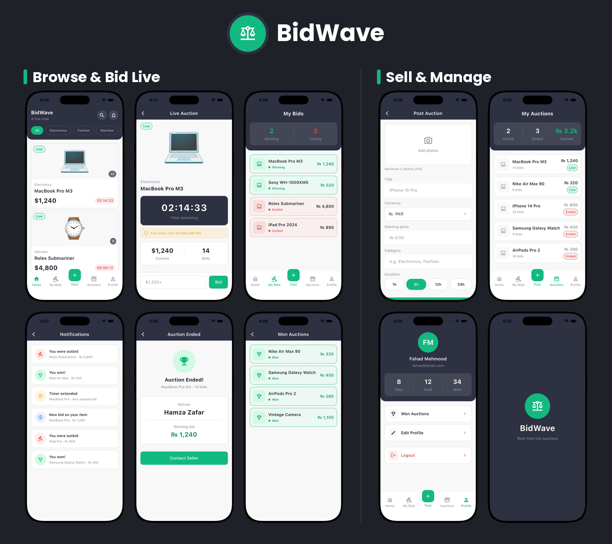

</p>

<br>

|                Splash                |               Login                |                Sign Up                |
| :----------------------------------: | :--------------------------------: | :-----------------------------------: |
| 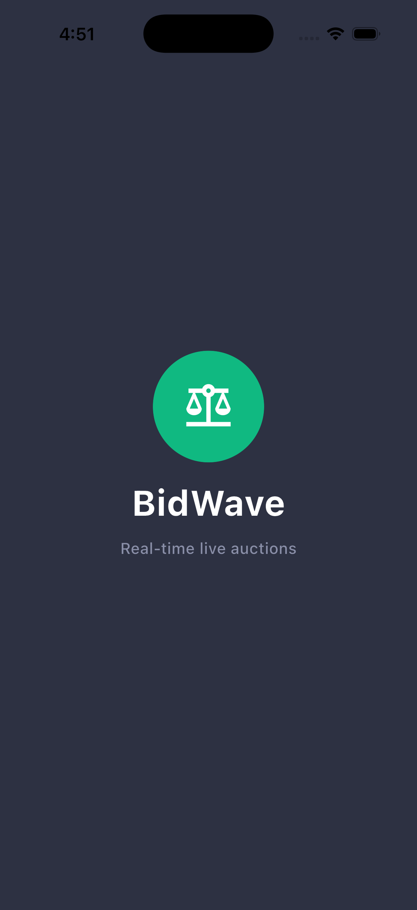 | 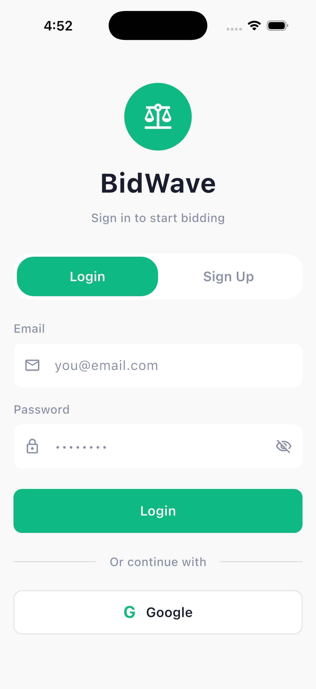 | 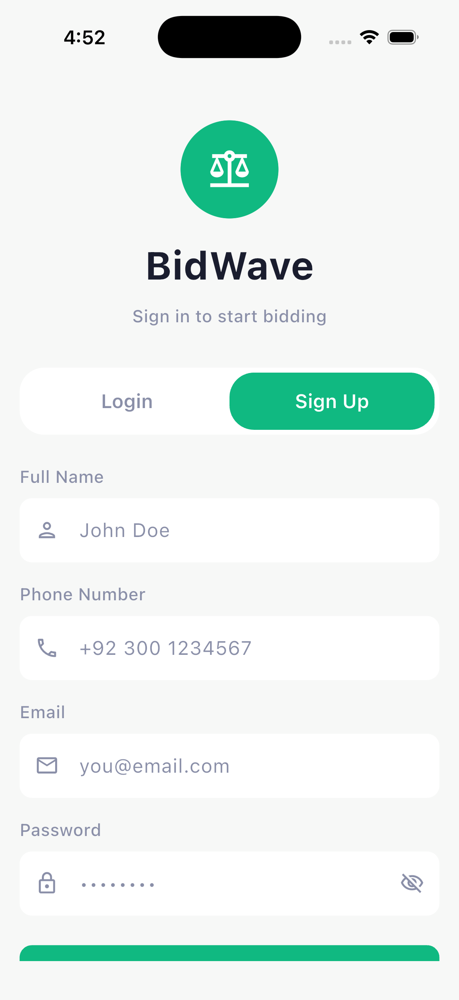 |

|       Home (Live Auctions)       |                    Auction Detail                    |                My Bids                 |
| :------------------------------: | :--------------------------------------------------: | :------------------------------------: |
| 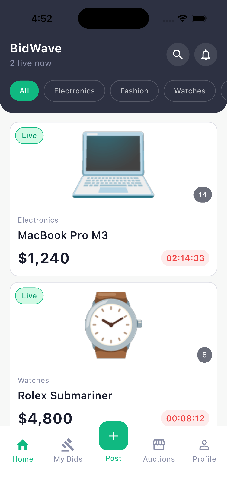 | 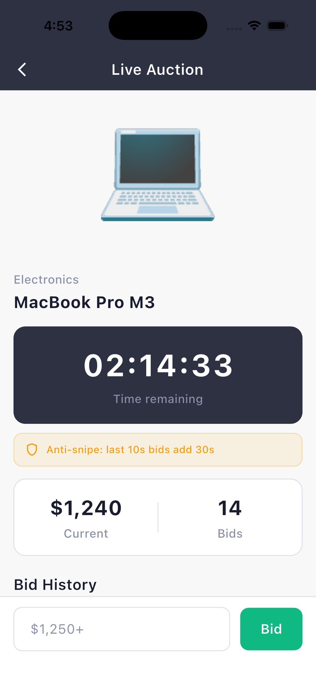 | 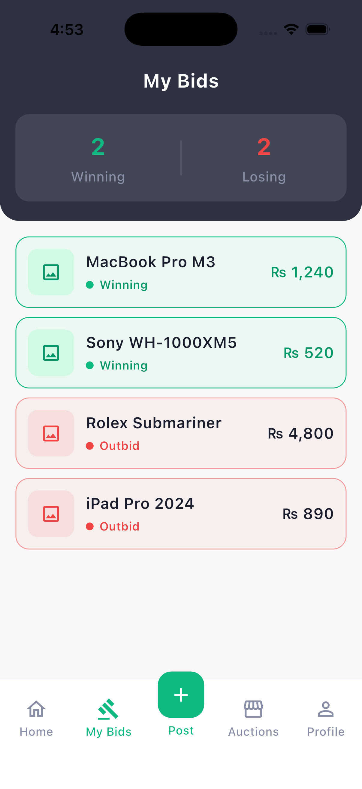 |

|                   Post Auction                   |                  My Auctions                   |                   Notifications                    |
| :----------------------------------------------: | :--------------------------------------------: | :------------------------------------------------: |
| 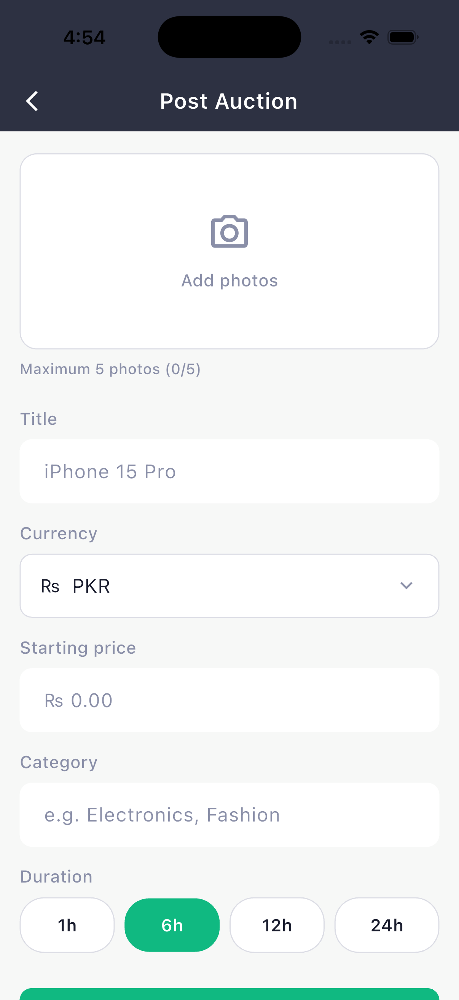 | 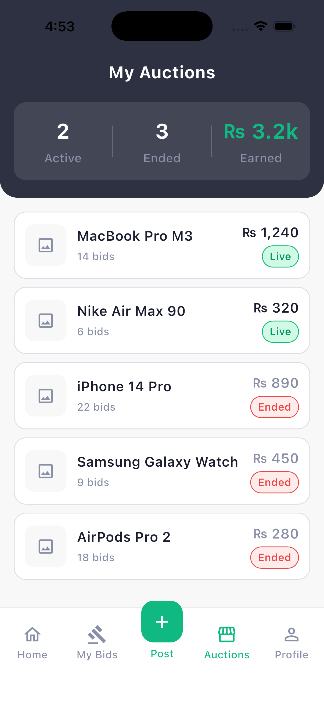 | 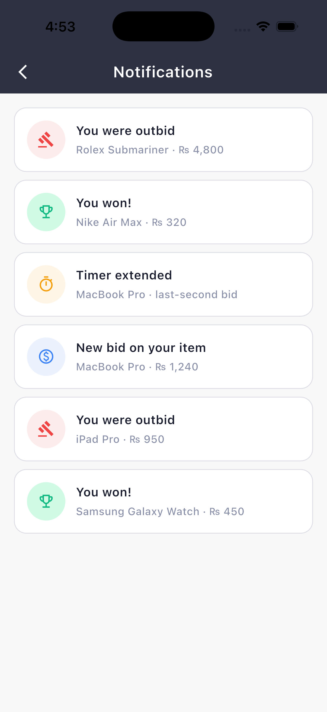 |

|                Winner                |                   Won Auctions                   |                Profile                 |
| :----------------------------------: | :----------------------------------------------: | :------------------------------------: |
| 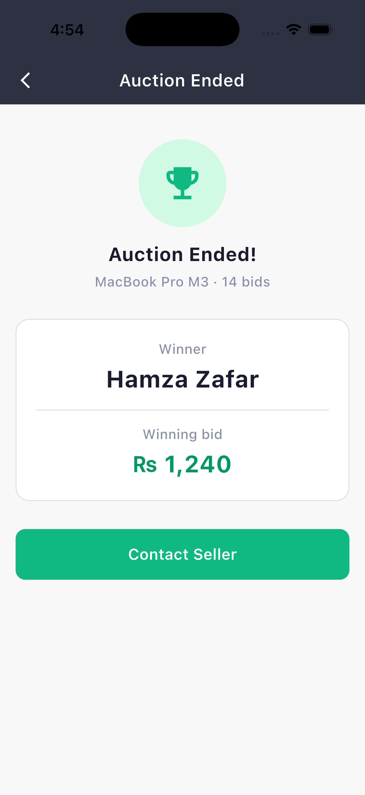 | 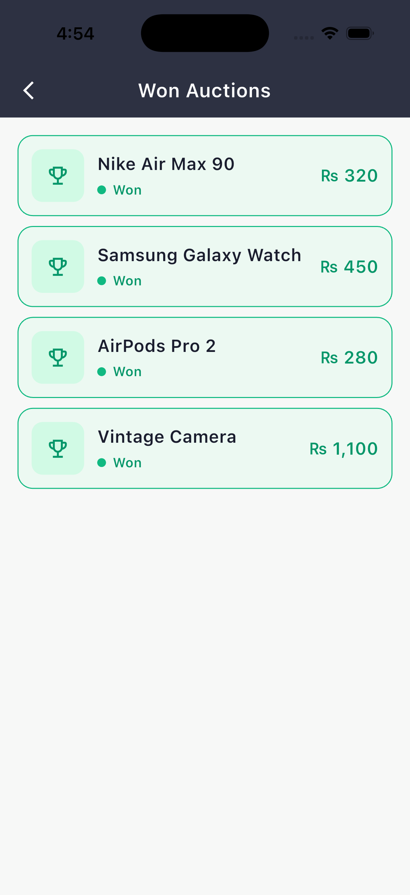 | 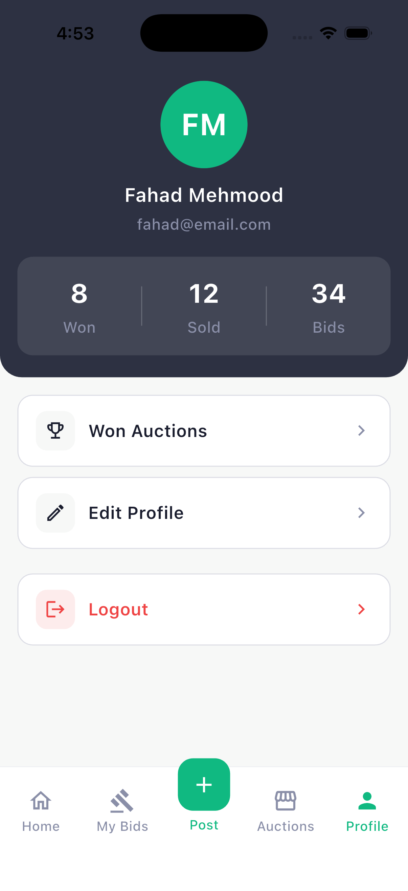 |

|                   Edit Profile                   |
| :----------------------------------------------: |
| 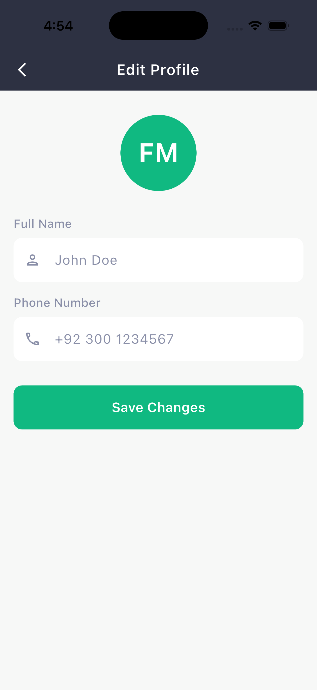 |

---

## Architecture Overview

**The flow of a single bid:**

```
BidInputBar (widget)
   → AuctionDetailBloc receives BidSubmitted event
      → PlaceBidUseCase
         → BidRepository (interface, domain)
            → BidRepositoryImpl (data)
               → BidRemoteDataSource → Firestore transaction
                  ↳ validates amount, applies anti-snipe, updates atomically
   ← Bloc emits new state (loading → success / error)
UI rebuilds via BlocBuilder / BlocListener
```

**Key design decisions:**

- **Bids run inside Firestore transactions**, so two people bidding at the same instant can't corrupt the price — the higher valid bid always wins.
- **Anti-snipe is enforced inside the transaction** (not just on the client), so the rule can't be bypassed.
- **Cloud Functions handle the fan-out** — outbid alerts, "you won" notifications, and auto-closing auctions when the timer expires — which is what makes notifications reliable even when the app is closed.
- **Models extend entities** (Liskov substitution), so the UI only ever sees pure domain types.
- **BLoCs are registered as factories**; repositories, use cases, and data sources as lazy singletons.

---

## 4. Getting Started

### Prerequisites

- Flutter SDK (3.12.0 or newer)
- A Firebase project
- Node.js 22 (for Cloud Functions)

### Setup

1. **Clone the repository**

   ```bash
   git clone https://github.com/<your-username>/bidwave.git
   cd bidwave
   ```

2. **Install Flutter dependencies**

   ```bash
   flutter pub get
   ```

3. **Configure Firebase** (uses the [FlutterFire CLI](https://firebase.flutter.dev/docs/cli))

   ```bash
   flutterfire configure
   ```

   This generates `lib/firebase_options.dart` and `android/app/google-services.json`.

   In the Firebase Console, enable:
   - **Authentication** → Email/Password + Google providers
   - **Cloud Firestore**
   - **Storage**
   - **Cloud Messaging**

4. **Add your SHA-1 / SHA-256 fingerprints** (required for Google Sign-In)

   ```bash
   cd android && ./gradlew signingReport
   ```

   Paste them into Firebase Console → Project Settings → your Android app, then re-download `google-services.json`.

5. **Deploy the Cloud Functions**

   ```bash
   cd functions
   npm install
   firebase deploy --only functions
   ```

   > Note: scheduled functions (auto-closing auctions) require the Firebase **Blaze** plan.

6. **Run the app**
   ```bash
   flutter run
   ```

---

## 5. App APK

A ready-to-install APK is available so the app can be tested on any Android device without building from source.

➡️ **[Download the latest APK from GitHub Releases](https://github.com/FahadMehmood056/BidWave/releases/tag/v1.0.0)**

**To build the APK yourself:**

```bash
flutter build apk --release
```

The output will be at `build/app/outputs/flutter-apk/app-release.apk`.

> **Tip:** On GitHub, upload the APK under **Releases** (Releases → Draft a new release → attach the `.apk` as a binary). This keeps large files out of the repo and gives users a clean download link.

<div align="center">

**Built with using Flutter & Firebase**

BidWave — _Real-time live auctions_

</div>
